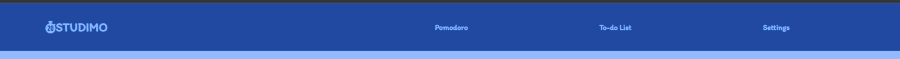
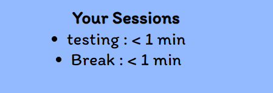
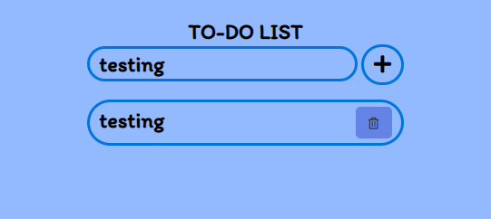
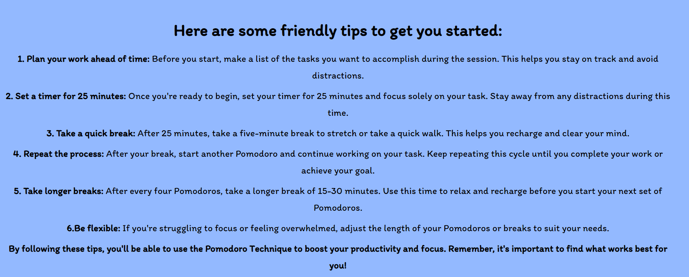

# STUDIMO
Welcome to STUDIMO, your go-to destination for boosting productivity and focus through the Pomodoro Technique. Offers an easy-to-use timer that allows you to optimize your study sessions, a to-do list, and comprehensive information on how to make the most of the technique. Whether you're a student, professional, or just looking to improve your productivity, STUDIMO has everything you need to achieve your goals. By breaking down your work into manageable intervals with timed breaks in between, you can accomplish more in less time and with less stress.

Experience the benefits of the Pomodoro Technique for yourself by giving STUDIMO a try today!

[View deployed site here](https://sandrac98.github.io/studimo/)


The goals of this website are:
* Help individuals increase their productivity and focus through the use of the Pomodoro Technique
* Provide timer that implements the technique and assists users in breaking down their work into manageable chunks of time with breaks in between
* Encourage visitor to  get more work done in less time and with less stress.

# Table of Contents  

## Contents
- [UX](#ux)
  * [Ideal User](#ideal-user)
- [Features](#features)
  + [Existing Features](#existing-features)
  + [Features Left To Implement](#features-left-to-implement)
- [Design](#design)  
  + [Colour Scheme](#colour-scheme)
-[Wireframes](#wireframes)
- [Testing](#testing)
- [Deployment](#deployment)
  + [Creating a Gitpod Workspace](#creating-a-gitpod-workspace)
  + [GitHub Pages](#github-pages)
  + [Forking the GitHub Repository](#forking-the-github-repository)
  + [Making a Local Clone](#making-a-local-clone)
- [Credits](#credits)
# UX
## Ideal User
### The ideal visitor for this website is:

* Someone who is looking to improve their productivity and focus.
* someone  who is interested in using the Pomodoro Technique to achieve their goals.
* Anyone who wants to increase their efficiency and manage their time more effectively.
* The ideal visitor could come from a variety of backgrounds.


### User stories

1. As a student, I want to be able to set a timer for 25-minute study sessions and 5-minute breaks, so I can stay focused and refreshed during my study sessions.

2. As a language learner, I want to be able to use the Pomodoro Technique to efficiently practice my language skills, so I can make faster progress and achieve my learning goals.

3. As a busy professional, I want to be able to easily use the Pomodoro Technique to break down my work into manageable chunks, so I can stay focused and reduce stress throughout the workday.


# Features 
## Existing Features
- The website's navigation bar is designed to be responsive, appearing on every page and remaining fixed in place. Its layout and appearance adjust according to different screen sizes and devices, with a hamburger menu replacing it on smaller screens. The navigation bar's purpose is to make navigation between different parts of the website easier, eliminating the need for users to rely on the back button. 



- Timer: The fundamental feature of a STUDIMO is its timer, which is initially set to a 25-minute work interval followed by a 5-minute break - the recommended time for implementing the Pomodoro technique. However, the timer is entirely customizable to accommodate the user's preferred session duration. Additionally, users can rename the timer to keep track of the time they've allocated to a particular task. 


- Pause/Stop Button: Incorporating a pause and stop button in a Pomodoro timer offers various advantages such as flexibility, efficiency, and control. With the ability to pause or stop the timer, users have complete control over their Pomodoro sessions, which gives them the assurance that they won't need to restart the timer and lose their progress. This control enhances the user's overall sense of peace of mind and empowers them to manage their time more effectively. 


- Session List: The "Your Sessions" section on STUDIMO is a handy feature that enables the user to keep track of their sessions easily. With this feature, they effortlessly monitor their activity and stay updated on their progress. 



- To-do List: Studimo also incorporates a to-do list feature that enables users to monitor the tasks they need to accomplish. It features an add button and a delete button once an item has been added to the list. 



- Settings: By accessing the "Settings" section, the user has the ability to fully customize the duration of both the "work" and "break" timers.  


- Tips: Within this section of STUDIMO, the user can discover valuable tips for effectively implementing the Pomodoro technique into their daily tasks. 


## Features Left to Implement

- I would like to implement the option to create an account for convenient tracking of all sessions conducted.
- I would like to incorporate the option to integrate with the calendar app for effective monitoring of future events.


# Design
## Colour Pallet

I chose to use various shades of blue for STUDIMO with the intention of helping students stay focused during their study sessions. There is no definitive scientific evidence to support the claim that blue is universally good for studying, but certain studies have suggested that blue may have a positive effect on cognitive performance and concentration for some people.

One potential reason why blue may be beneficial for studying is its calming and soothing properties. Blue is often associated with feelings of relaxation and tranquility, which can help reduce stress and anxiety levels that might otherwise interfere with focus and productivity. By promoting a sense of calm, blue may help students concentrate on their work more effectively and for longer periods of time.

Another possible reason why blue might be beneficial for studying is that it can help stimulate the brain and enhance mental alertness. Blue is a highly stimulating color that has been shown to increase brain activity and cognitive function, which can improve memory recall and the ability to process information. This increased brain activity may help students better retain and recall important information when studying.

Overall, while the effects of blue may vary from person to person, incorporating blue into your study environment, such as through the use of blue lighting or accents, may be worth considering if you find it helps you focus and concentrate better.


# Deployment

## Creating a Gitpod Workspace

The project was created in Gitpod using the Code Institute Gitpod Full Template using these steps:

1. Log in to GitHub and go to the [Code Institute student template for Gitpod](https://github.com/Code-Institute-Org/gitpod-full-template)
2. Click 'Use this Template' next to the Green Gitpod button.
3. Add a repository name and click 'Create reposiory from template'.
4. This will create a copy of the template in your own repository. Now you can click the green 'Gitpod' button to open a workspace in Gitpod.

## GitHub Pages

The project was deployed to GitHub Pages using these steps:

1. Log in to GitHub and go to the [GitHub Repository](https://github.com/Sandrac98/studimo)
2. Locate the Navbar at the top of the Repository (not top of page). Click the Settings tab.
3. Locate the Navbar on the left hand side of the page. Click the "Pages" section (under 'Code and automation').
4. Under "Source", click the dropdown called "None" and select "main". Click save.
5. The page will automatically refresh.
6. A notification will appear at the top of the page with the [link](https://github.com/Sandrac98/studimo) to the deployed site. You can return to this GitHub Pages section to access the link.

## Forking the GitHub Repository

Forks are used to propose changes to someone else's project or to use someone else's project as a starting point for your own idea. By forking the GitHub Repository you make a copy of the original repository on our GitHub account to view and/or make changes without affecting the original repository.

To Fork a Github Repository:

1. Log in to GitHub and go to the [GitHub Repository](https://github.com/Sandrac98/studimo)
2. Locate the Fork button in the top-right corner of the page, click Fork.
3. You should now have a copy of the original repository in your GitHub account.

## Making a Local Clone

You will now have a fork of the repository, but you don't have the files in that repository locally on your computer.

To make a local clone:

1. Log in to GitHub and go to the [GitHub Repository](https://github.com/Sandrac98/studimo)
2. Above the list of files, click  Code.
3. To clone the repository using HTTPS, under "Clone with HTTPS", click the 'Copy' icon. To clone the repository using an SSH key, including a certificate issued by your organization's SSH certificate authority, click Use SSH, then click the 'Copy' icon. To clone a repository using GitHub CLI, click Use GitHub CLI, then click the 'Copy' icon.
4. Open Git Bash.
5. Change the current working directory to the location where you want the cloned directory.
6. Type git clone, and then paste the URL you copied earlier. It will look like this, with your GitHub AE username instead of YOUR-USERNAME:

```
$ git clone https://github.com/YOUR-USERNAME/YOUR-REPOSITORY
```

7. Press Enter. Your local clone will be created.

Click [Here](https://docs.github.com/en/github-ae@latest/get-started/quickstart/fork-a-repo) for the GitHub quick start guide with images and more detailed explanations of the above process.


# Credits 
- The favicon icon was taken from <a href="https://www.flaticon.com/free-icons/timer" title="timer icons">Timer icons created by Freepik - Flaticon</a>
- Timer sound alert was taken from <a href="https://www.epidemicsound.com/music/featured/">Epidemic Sound</a>
- The code for the Navbar was taken from <a href="https://codepen.io/MinzCode/pen/bGexzXw">CodePen Home Responsive Fixed Navigation Bar - Only HTML, CSS</a>
