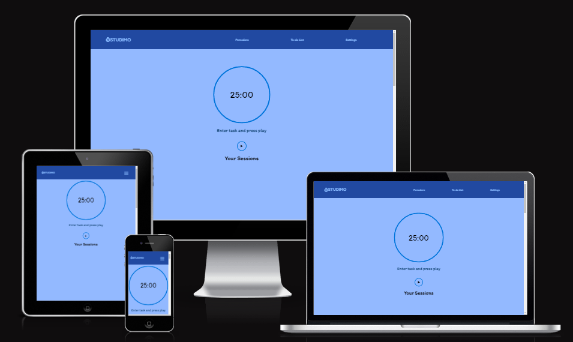

# STUDIMO
Welcome to STUDIMO, your go-to destination for boosting productivity and focus through the Pomodoro Technique. Offers an easy-to-use timer that allows you to optimize your study sessions, a to-do list, and comprehensive information on how to make the most of the technique. Whether you're a student, professional, or just looking to improve your productivity, STUDIMO has everything you need to achieve your goals. By breaking down your work into manageable intervals with timed breaks in between, you can accomplish more in less time and with less stress.

Experience the benefits of the Pomodoro Technique for yourself by giving STUDIMO a try today!

[View deployed site here](https://sandrac98.github.io/Studimo./)

The goals of this website are:
* Help individuals increase their productivity and focus through the use of the Pomodoro Technique
* Provide timer that implements the technique and assists users in breaking down their work into manageable chunks of time with breaks in between
* Encourage visitor to  get more work done in less time and with less stress.

# UX
## Ideal client
### The ideal visitor for this website is:

* Someone who is looking to improve their productivity and focus.
* someone  who is interested in using the Pomodoro Technique to achieve their goals.
* Anyone who wants to increase their efficiency and manage their time more effectively.
* The ideal visitor could come from a variety of backgrounds.

### Client stories

1. As a student, I want to be able to set a timer for 25-minute study sessions and 5-minute breaks, so I can stay focused and refreshed during my study sessions.

2. As a language learner, I want to be able to use the Pomodoro Technique to efficiently practice my language skills, so I can make faster progress and achieve my learning goals.

3. As a busy professional, I want to be able to easily use the Pomodoro Technique to break down my work into manageable chunks, so I can stay focused and reduce stress throughout the workday.

# Features 
## Existing Features
 The website's navigation bar is designed to be responsive, appearing on every page and remaining fixed in place. Its layout and appearance adjust according to different screen sizes and devices, with a hamburger menu replacing it on smaller screens. The navigation bar's purpose is to make navigation between different parts of the website easier, eliminating the need for users to rely on the back button.

- Timer: The fundamental feature of a STUDIMO is its timer, which is initially set to a 25-minute work interval followed by a 5-minute break - the recommended time for implementing the Pomodoro technique. However, the timer is entirely customizable to accommodate the user's preferred session duration. Additionally, users can rename the timer to keep track of the time they've allocated to a particular task.

- Pause/Stop Button: Incorporating a pause and stop button in a Pomodoro timer offers various advantages such as flexibility, efficiency, and control. With the ability to pause or stop the timer, users have complete control over their Pomodoro sessions, which gives them the assurance that they won't need to restart the timer and lose their progress. This control enhances the user's overall sense of peace of mind and empowers them to manage their time more effectively.

- To-do List: Studimo also incorporates a to-do list feature that enables users to monitor the tasks they need to accomplish.

## Features Left to Implement

- I would like to implement the option to create an account for convenient tracking of all sessions conducted.
- I would like to incorporate the option to integrate with the calendar app for effective monitoring of future events.

## Colour Pallet

I chose to use various shades of blue for STUDIMO with the intention of helping students stay focused during their study sessions. There is no definitive scientific evidence to support the claim that blue is universally good for studying, but certain studies have suggested that blue may have a positive effect on cognitive performance and concentration for some people.

One potential reason why blue may be beneficial for studying is its calming and soothing properties. Blue is often associated with feelings of relaxation and tranquility, which can help reduce stress and anxiety levels that might otherwise interfere with focus and productivity. By promoting a sense of calm, blue may help students concentrate on their work more effectively and for longer periods of time.

Another possible reason why blue might be beneficial for studying is that it can help stimulate the brain and enhance mental alertness. Blue is a highly stimulating color that has been shown to increase brain activity and cognitive function, which can improve memory recall and the ability to process information. This increased brain activity may help students better retain and recall important information when studying.

Overall, while the effects of blue may vary from person to person, incorporating blue into your study environment, such as through the use of blue lighting or accents, may be worth considering if you find it helps you focus and concentrate better.
[Colour Pallet](https://colorkit.co/palette/87b9ff-93b9ff-0075db-80baed-000000/)

# Testing  

The website was tested for responsiveness using the Google Chrome browser and the Chrome Developer Tools to check the different screen sizes. Additionally, the website was also tested on a Samsung Galaxy a52 5G using the Samsung internet browser. No errors were found during the testing process. 

## User Stories Testing.
* As a productivity-focused user, I desire the ability to customize my Pomodoro timer to 25 minutes, allowing for a uninterrupted work session.
   - This can be achieved by simply hitting the 'Play' button.

* As a visually-oriented user, I desire the ability to view a visual representation of my Pomodoro timer, making it easier to track the remaining time for my work session.
   - This can be achieved by checking the time left on the current session.

* If I have completed a task within the designated time, I may choose to reset the timer in order to initiate a new Pomodoro session for a fresh task.
   - This can be achieved by simply renaming the timer and adjusting its duration to suit the user's preferences.

## Manual Testing.

|Test Label   | Test Action   | Expected Outcome   | Test Outcome   |   
|-------------|---------------|--------------------|----------------|
|Timer has reset by refreshing the page|Refresh page|Timer resets back to 25 minutes|PASS| 
|Timer starts when 'Play' icon is pressed| Press 'Play' icon|Timer will start|PASS|   
|Break starts when work timer finish| Let timer run out to check break session starts right away after work session finish|Break session timer starts after work timer ends|PASS|   
|Customize TImer| Ensure that timer can be customize for work and break sessions after being stop and start again|Timer will start with the new time lenght |PASS|
|Enter task name on to-do list|Click '+' button to check if user is ask to enter name task|Alert pop-up will appear|PASS|
|Delete task on to-do list|Add new task and then press 'Delete' icon|Task will be deleted and will be removed from the list|PASS|

# Validator Testing 

- HTM
 - Code was checked using https://validator.w3.org/ error showed in the results is explained at the unfixed bug section

 - CSS
  - No errors were found when passing through the official [(Jigsaw) validator](./assets/readme-images/css-validation.png)

- Lighthouse test.

# Unfixed Bugs
 - I used the W3 Validator to check each page of the website and found some errors in the navbar. However, this code was sourced from another website and I have included a link to the original source in the code. As a result, I have not attempted to fix the errors highlighted by the validator. [navBar-error](./assets/readme-images/navbar-error.png)

# Deployment

- The site was deployed to GitHub pages. The steps to deploy are as follows: 
   - In the GitHub repository, navigate to the Settings tab 
   - then select 'Pages' from the menu on the left.
   - From the source section drop-down menu, select the Master Branch
   - Once the master branch has been selected, the page will be automatically refreshed with a detailed ribbon display to indicate the successful deployment. 

# Credits 
The favicon icon was taken from <a href="https://www.flaticon.com/free-icons/timer" title="timer icons">Timer icons created by Freepik - Flaticon</a>