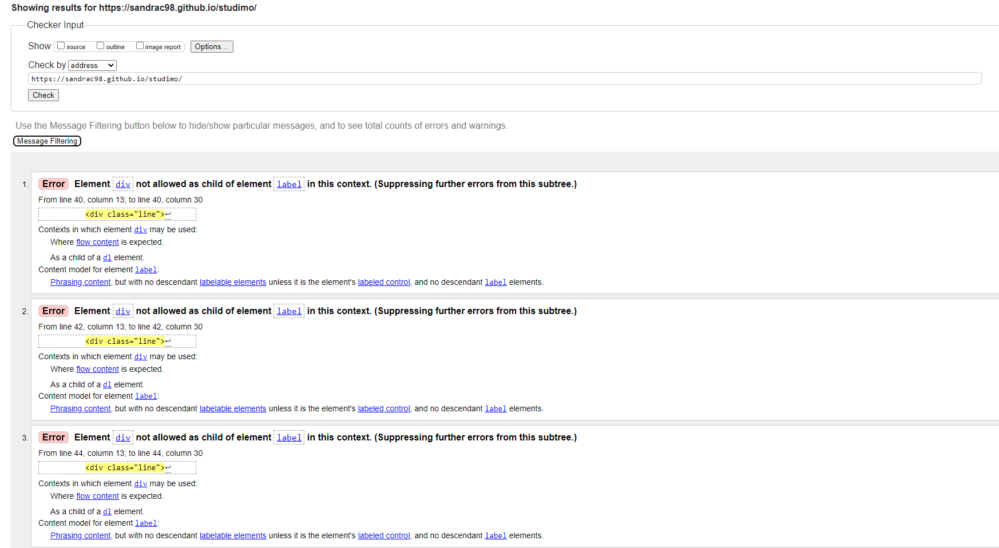
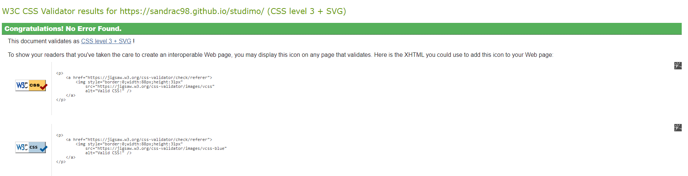
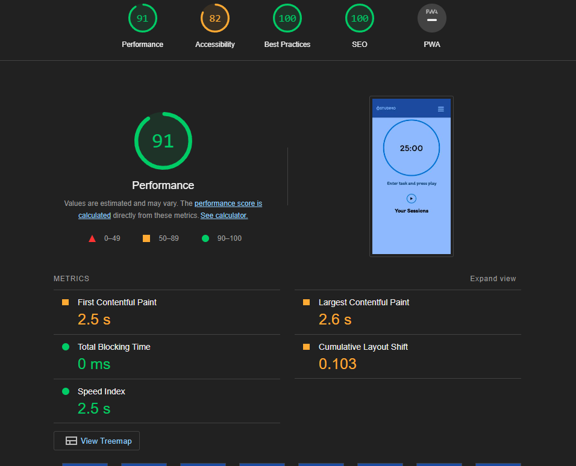
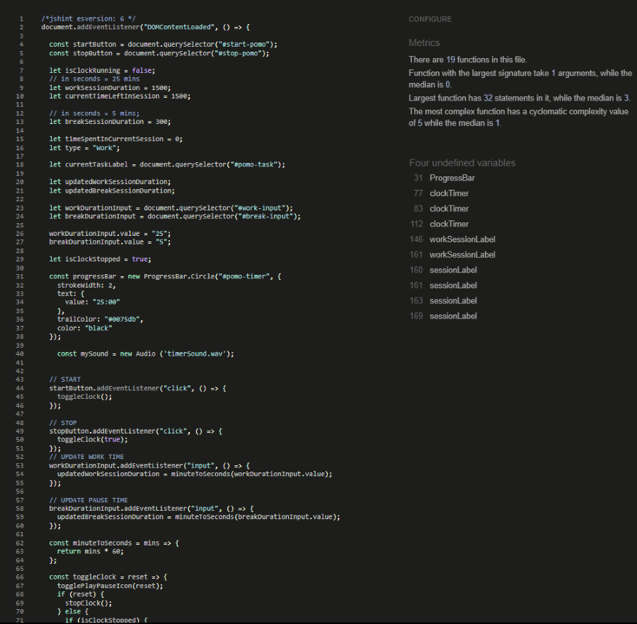

# Testing 

STUDIMO was tested for responsiveness using the Google Chrome browser and the Chrome Developer Tools to check the different screen sizes. Additionally, the website was also tested on a Samsung Galaxy a52 5G using the Samsung internet browser. No errors were found during the testing process.

- [User Stories Testing](#user-stories-testing)
- [Manual Testing](#manual-testing)
- [W3C HTML Validator](#w3c-html-validator) 
- [W3C CSS Validator](#w3c-css-validator)
- [Lighthouse](#lighthouse-score)
- [JSHINT Javascript Code Quality Tool](#jshint-javascript-code-quality-tool)
- [Unfixed Bugs](#unfixed-bugs)

## User Stories Testing.
* As a productivity-focused user, I desire the ability to customize my Pomodoro timer to 25 minutes, allowing for a uninterrupted work session.
   - This can be achieved by simply hitting the 'Play' button.

* As a visually-oriented user, I desire the ability to view a visual representation of my Pomodoro timer, making it easier to track the remaining time for my work session.
   - This can be achieved by checking the time left on the current session.

* If I have completed a task within the designated time, I may choose to reset the timer in order to initiate a new Pomodoro session for a fresh task.
   - This can be achieved by simply renaming the timer and adjusting its duration to suit the user's preferences.

## Manual Testing.

|Test Label   | Test Action   | Expected Outcome   | Test Outcome   |   
|-------------|---------------|--------------------|----------------|
|Timer has reset by refreshing the page|Refresh page|Timer resets back to 25 minutes|PASS| 
|Timer starts when 'Play' icon is pressed| Press 'Play' icon|Timer will start|PASS|   
|Break starts when work timer finish| Let timer run out to check break session starts right away after work session finish|Break session timer starts after work timer ends|PASS|   
|Customize TImer| Ensure that timer can be customize for work and break sessions after being stop and start again|Timer will start with the new time lenght |PASS|
|Enter task name on to-do list|Click '+' button to check if user is ask to enter name task|Alert pop-up will appear|PASS|
|Delete task on to-do list|Add new task and then press 'Delete' icon|Task will be deleted and will be removed from the list|PASS|

 
# W3C HTML Validator
 - Code was checked using https://validator.w3.org/ error showed in the results is explained at the unfixed bug section 

 

# W3C CSS Validator
- No errors were found when passing through https://jigsaw.w3.org/css-validator/
  

# Lighthouse score. 

# JSHINT Javascript Code Quality Tool
The code for the Pomodoro and the To-Do List were tested separately.

# Unfixed Bugs
 - I used the W3 Validator to check each page of the website and found some errors in the navbar. However, this code was sourced from another website and I have included a link to the original source in the code. As a result, I have not attempted to fix the errors highlighted by the validator. 
 
 
